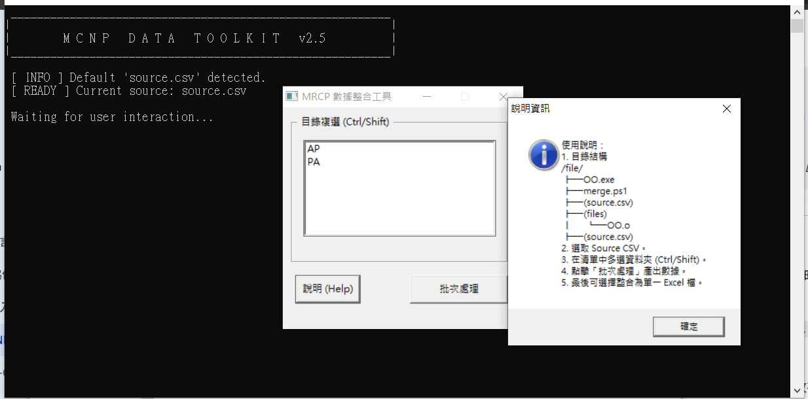

這是一個非常好的補充！加入成果截圖能讓使用者在下載前就直觀地了解工具的效用。

我已經為你更新了 `README.md`。我將 **成果展示 (Result Preview)** 提升到了專案簡介之後，並調整了部分 Markdown 語法，使其在 GitHub 上的呈現更加美觀且現代化。

---

# MCNP Data Toolkit v2.5

**MCNP Data Toolkit** 是一款專為處理 MCNP 輸出檔案（`.o` 檔）所設計的自動化整合工具。本工具能夠自動解析指定資料夾內的 Tally 數據，與 `source.csv` 的原始參數進行橫向合併，並透過 PowerShell 腳本自動彙整為專業的 Excel 報表。

## 📸 成果展示 (Result Preview)


> **圖：自動化處理展示**。

---

## 🚀 核心功能

* **GUI 批次處理**：提供直觀的 Windows 視窗介面，支援多選資料夾一鍵批次處理。
* **智能數據解析**：
* 自動偵測 `nps`（歷史粒子數）與 `tally` 區塊。
* 具備「數據校準」功能，智能剔除無效標籤或空白欄位。
* 採用狀態機（State Machine）解析技術，確保大型數據讀取穩定性。


* **Excel 自動化美化**：
* 自動將多個 CSV 檔案整合為單一 `.xlsx` 活頁簿。
* 格式美化：**Times New Roman** 字體、欄寬自適應、關鍵標頭自動上色。


## 📁 檔案結構說明

* **`main.c`**: 程式進入點，處理 Win32 GUI 與批次邏輯。
* **`tool.h` / `config.h**`: 核心演算法與資料結構，負責解析 `.o` 檔與動態記憶體管理。
* **`merge.ps1`**: PowerShell 腳本，呼叫 Excel COM 元件執行報表彙整與樣式設定。
* **`source.csv`**: 使用者定義的基準參數表（對齊基準）。

## 🛠️ 安裝與編譯環境

* **作業系統**：Windows (支援 Win32 API)
* **編譯器**：Dev-C++、MinGW 或 GCC。
* *編譯標記：需連結 `-lcomdlg32 -lshell32 -lgdi32*`


* **軟體需求**：需安裝 **Microsoft Excel** 才能執行自動化整合功能。

## 📖 使用手冊

### 1. 準備數據

確保執行檔與腳本位於根目錄，並將待處理的資料夾準備好：

```text
/Project/
├── main.exe           # 主程式
├── merge.ps1          # Excel 整合腳本
├── source.csv         # 基礎對照表
└── Folder_A/          # 資料夾內含多個 .o 檔案

```

### 2. 選取資料夾

啟動 `main.exe`，程式會自動掃描目錄。在視窗中按住 **Ctrl** 或 **Shift** 選取目標資料夾後，點擊 **「批次處理」**。

### 3. 生成 Excel

處理完成後，程式會詢問是否執行 Excel 整合。點擊「是」後，系統會自動開啟 Excel 引擎進行美化處理，最終產出 **`MRCP_Total_Summary.xlsx`**。

## ⚠️ 注意事項

* **編碼規範**：匯出的 CSV 檔案採用 UTF-8 BOM 格式，避免 Excel 發生亂碼。
* **命名規則**：工具會嘗試解析檔名中的參數（如 `AP-0.01.o`），請保持檔名結構清晰。
* **開發者備註**：程式內建嚴謹的記憶體釋放邏輯，支援處理數萬列之大型數據。

---

## 📜 授權條款 (License)

本專案採用 **MIT License** 授權。

**KikKoh @2026** - *Dedicated to Nuclear Engineering Data Solutions.*
