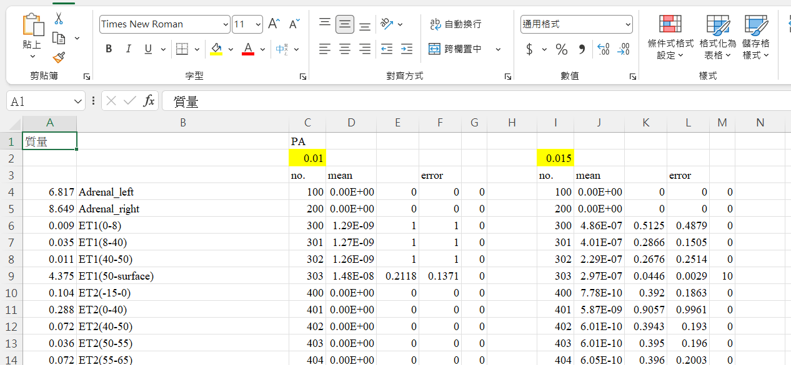

# MCNP Data Toolkit v2.7.3

**MCNP Data Toolkit** 是一款專為核能與醫學物理工程研究設計的高效能數據整合工具。它能將 MCNP 模擬產生的海量文字輸出檔案（`.o` 檔）轉化為結構化的科研報表。透過 C 語言的強大解析能力與 PowerShell 的 Excel 自動化技術，大幅縮短數據整理時間。

## 📸 成果展示 (Result Preview)


> **圖 1：v2.5的GUI 批次選取介面與後台狀態監控** 。

> **圖 2：PowerShell 自動化生成的美化版 Excel 報表**。

---

## 🚀 v2.7 新增核心功能 (New Features)

* **自動雲端更新 (Auto-Update System)**：
* **即時版本對比**：啟動時自動連線 GitHub 檢查最新版本，確保研究員始終使用最穩健的算法。
* **一鍵更新**：整合 `WinInet` 與 `UrlMon` 異步下載技術，無需手動去網頁下載。


* **智能權限管理 (UAC Elevation)**：
* **自動權限提升**：當程式偵測到位於受限目錄（如 Program Files）時，會主動要求管理員權限，解決更新或讀取受阻的問題。
* **自毀式更新腳本**：採用後台批次處理技術，更新完成後自動取代舊檔並重啟，實現「零殘留」更新。


* **文件篩選器優化**：
* **精準檔案過濾**：檔案選取視窗預設強制篩選 `.csv` 格式，減少誤選機率。


---

## 🛠 運作流程 (Workflow)

1. **掃描 (Scanning)**：自動遍歷目錄，識別並按字母順序排列所有 `.o` 輸出檔案。
2. **解析 (Parsing)**：使用狀態機模型從文字檔中精確提取粒子數 (`NPS`) 與各組 `Tally` 數據。
3. **校準 (Calibration)**：對比 `source.csv`，自動進行數據對齊、標籤清洗並剔除無效空值。
4. **整合 (Integration)**：驅動 Excel COM 物件，將多個資料夾數據彙整至獨立分頁並執行樣式美化。

---

## 🛠️ 安裝與開發環境

* **作業系統**：Windows 10 / 11
* **軟體依賴**：必須安裝 **Microsoft Excel** (用於執行 `merge.ps1` 自動化功能)。
* **編譯環境**：
* 編譯器：Dev-C++ / MinGW-w64 / GCC
* **連結標記 (Linker Flags)**：
```bash
-lcomdlg32 -lshell32 -lgdi32 -lwininet -lurlmon -lshlwapi

```


---

## 📖 使用手冊 (Quick Start)

### 1. 環境佈置

將 `main.exe`、`merge.ps1` 與 `source.csv` 置於同一目錄，並將模擬數據（`.o` 檔）按資料夾分類放置於子目錄中。

### 2. 啟動與版本檢查

執行 `main.exe`。系統會自動連網檢查更新。若有新版本，請點選「是」，程式將自動完成更新並重啟。

### 3. 一鍵生成報表

在介面選取目標資料夾後，點擊 **「批次處理」**。解析完成後，系統將調用 PowerShell 在背景完成所有 Excel 排版，最終生成 `MCNP_Total_Summary.xlsx`。

---

📁 檔案結構說明

| 檔案名稱 | 說明 |
| --- | --- |
| **`main.exe`** | 核心程式：具備自動更新、GUI 介面與批次調度邏輯。 |
| **`tools.h / config.h`** | 演算法庫：負責狀態機解析、路徑安全檢查與內存管理。 |
| **`merge.ps1`** | 自動化腳本：負責調用 Excel COM 執行多表整合與排版。 |
| **`source.csv`** | 基準參數表：定義數據對齊的原始欄位與基礎資訊。 |

---

## 📜 授權條款 (License)

本專案採用 **MIT License** 授權。

**KikKoh @2026** - *Dedicated to Nuclear Engineering Data Solutions.*

---

### 💡 修正建議

1. **編譯器更新**：因為 v2.7 使用了 `wininet` 與 `urlmon`，請務必提醒團隊成員在 Dev-C++ 的「專案選項」中更新 **Linker 參數**，否則會出現 `undefined reference` 錯誤。
2. **網路連線**：若環境有防火牆攔截，可能會導致版本檢查失敗（程式會自動跳過檢查，不影響主功能使用）。

---

### 💡 開發者建議

1. **路徑檢查**：確保執行路徑中不包含特殊字元，以維持 PowerShell 腳本的穩定性。
2. **Excel 進程**：若腳本執行中斷，請檢查工作管理員中是否有殘留的 Excel 進程。

SORRY,I cannot distinguish between MRCP and MCNP before v2.7.3.

抱歉v2.7.3之前還分不清MRCP跟MCNP

**Oh my, it's quite a struggle to convert everything to UTF-8. Please excuse any garbled characters that may appear.**

Would you like me to refine the technical documentation for any of the specific C functions, such as the `loadSingleFileData` state machine logic?


